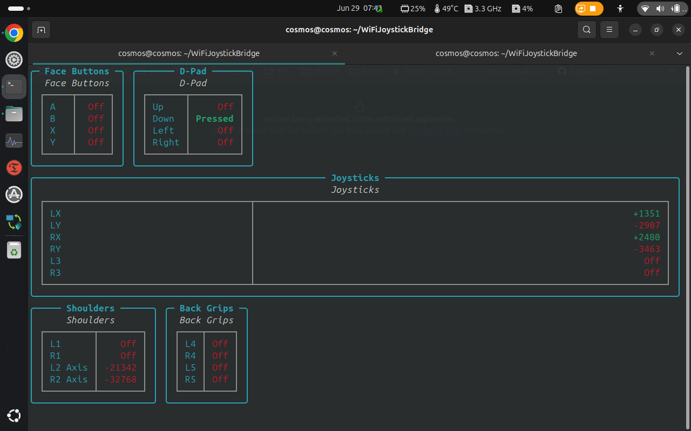

# SteamDeck Input Toolkit (SDL2 + Python)

This repository is a practical toolkit for developers who want to use the Steam Deck’s built-in controls (joysticks, triggers, and buttons) in Python. It provides everything you need to:

- Understand how SDL2 handles joystick input on the Steam Deck
- Reference accurate button and axis mappings
- Read and process controller input with minimal or modular scripts
- Integrate input handling into your own games or tools using a clean API

Whether you're prototyping, experimenting, or building a full project, this toolkit simplifies Steam Deck input handling with Python.

---

## ✨ Steam Deck Controls Mapped to SDL2

This project includes a visual reference showing how Steam Deck controls map to SDL2's input identifiers.


- **Joystick & Trigger Axes:**
  - Detected via `event.type == sdl2.SDL_JOYAXISMOTION`
  - Access with `event.jaxis.axis` (ID), and `event.jaxis.value` (value)


- **Buttons & D-Pad:**
  - Detected via `event.type in (sdl2.SDL_JOYBUTTONDOWN, SDL_JOYBUTTONUP)`
  - Access with `event.jbutton.button` (ID), and `event.jbutton.state` (0 or 1)


> ⚠️ Note: Touchpads are not handled by SDL2's joystick API and will not show up in this mapping.


## 📂 Overview of Included Scripts

Scripts included:

- `steamdeck_input_api.py`: Object-oriented version with reusable API and terminal UI.
- `simple_sdl2_input_reader.py`: Minimal SDL2 demo. Direct event polling and logging — ideal for understanding how SDL2 works.


## 🔧 Requirements

To install dependencies, use the included `requirements.txt` file:

### `requirements.txt`
```txt
PySDL2
rich
```

To install everything:
```bash
pip install -r requirements.txt
```

---

# 🧱 Script 1 — Class-Based API Version

### 📄 File: `steamdeck_input_api.py`

This modular version defines a `Joystick` class that encapsulates all SDL2 handling. It includes getter methods and even a visual dashboard using the `rich` library.

### How to Use the Joystick API

1. **Import and Create an Instance:**
```python
from steamdeck_input_api import Joystick
js = Joystick()
```

2. **Update the Input State (in a loop):**
```python
js.update()
```

3. **Access Control Groups:**
```python
print(js.face_buttons)
print(js.dpad_state)
print(js.shoulder_state)
print(js.joystick_state)
print(js.back_buttons)
print(js.full_state)
```

4. **Close When Done:**
```python
js.close()
```

### 📋 Core Methods
- `update()` — Polls SDL events and updates internal state
- `close()` — Releases SDL resources

### 📋 Properties
- `face_buttons` → States of A, B, X, Y
- `dpad_state` → D-pad buttons (Up/Down/Left/Right)
- `shoulder_state` → L1/R1 buttons + L2/R2 axes
- `joystick_state` → LX, LY, RX, RY, L3, R3
- `back_buttons` → Grip buttons L4–R5
- `full_state` → Combined dictionary with all raw data

### ▶️ Run the Dashboard
```bash
python3 steamdeck_input_api.py
```
Displays a live input dashboard in the terminal.



---

# 🧱 Script 2 — Minimal SDL2 Input Reader

### 📄 File: `simple_sdl2_input_reader.py`

This lightweight script shows raw input values in real time. Great for quick testing or learning how SDL2 handles events directly.

### ▶️ Run It
```bash
python3 scripts/simple_sdl2_input_reader.py
```

---

## 🧠 How SDL2 Reads Input (For Reference)

SDL2 uses a polling loop to process joystick input events. Learn while checking the File: `simple_sdl2_input_reader.py`

### Axis Motion Example (`SDL_JOYAXISMOTION`)
```python
if event.type == sdl2.SDL_JOYAXISMOTION:
    axis_id = event.jaxis.axis
    value = event.jaxis.value  # Range: -32768 to 32767
```
```python
axis_values[axis_id] = value
```

### Button Press Example (`SDL_JOYBUTTONDOWN`, `SDL_JOYBUTTONUP`)
```python
if event.type in (sdl2.SDL_JOYBUTTONDOWN, sdl2.SDL_JOYBUTTONUP):
    button_id = event.jbutton.button
    state = event.jbutton.state  # 1=pressed, 0=released
```
```python
button_values[button_id] = state
```

These concepts are used in both included scripts.

---

## 📄 License

MIT — free to use, modify, and share.

---

## 📬 Contributions

Pull requests and issue reports are welcome! Help expand the mapping, support new input types, or improve cross-platform support.
